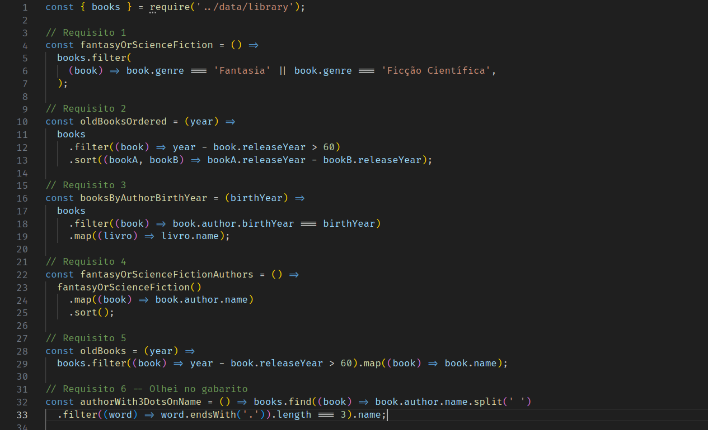

# README: Library organization



## Project Description

This is another project where I've utilized higher-order functions. I've written functions that employ filter, map, find, and sort to interact with an array to obtain formatted data.

### Technologies

- LINUX
- VSCODE
- JAVASCRIPT

### What I Learned

- How to use HOFs, like filter, map and find
- How to use conditionals inside HOFs

## How to Run the Project

1. Clone the repository:

   ```bash
   git clone https://github.com/feduarte-dev/library-organization
   ```

2. Navigate to the project directory:

   ```bash
   cd your-repository
   ```

3. Install dependencies:

   ```bash
   npm install
   ```

4. Test the application:

   ```bash
   npm run test
   ```

## Contributions

[Felipe](https://www.linkedin.com/in/feduarte-dev/) - /src


[Trybe](https://www.betrybe.com/) - Everything else
